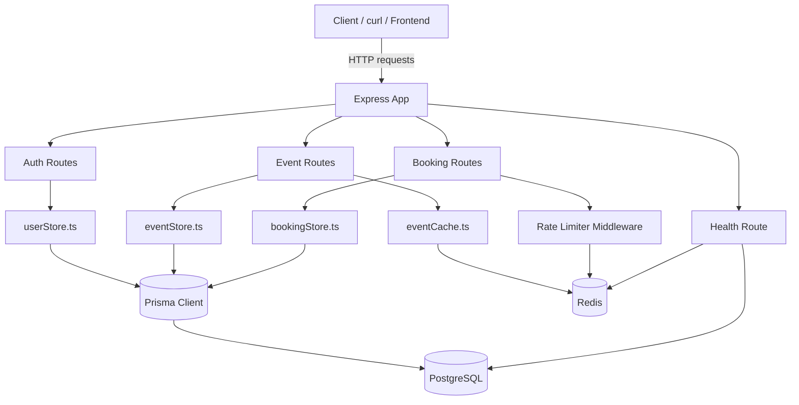

# EventBook API

A backend event-booking API demonstrating concurrency handling, containerized deployment, and caching/rate-limiting under real infrastructure constraints

> **Live Demo Link:** [EventBook API](https://eventbook-api-il5s.onrender.com/health)

## What this demonstrates

- Prevented race conditions on concurrent seat booking using Postgres row-level locking within transactions
- Implemented a hold/expiry state machine (PENDING -> CONFIRMED/EXPIRED) with lazy evaluation
- Containerized with multi-stage Docker builds and Compose-orchestrated service dependencies (healthcheck-gated startup)
- Redis-backend rate limiting and cache-aside pattern for read-heavy endpoints

## Tech Stack

      

## Architecture



Requests flow through Express into domain-specific route handlers (auth, events, bookings), which delegate all data access to a dedicated store layer — no route ever queries the database directly. The store layer talks to PostgreSQL through Prisma, using row-level locking within transactions for booking operations to prevent race conditions on seat availability. Redis backs two cross-cutting concerns that sit outside the store layer: per-user rate limiting on the booking endpoint, and a short-TTL cache-aside layer on event listings.

## Setup / running locally

```bash
git clone https://github.com/sisonjcs/eventbook-api.git
cp .env.example .env
docker compose up --build
docker compose exec app npx prisma migrate deploy
```

## API Overview

| Method | Endpoint                | Auth required        | Description                                             |
| ------ | ----------------------- | -------------------- | ------------------------------------------------------- |
| POST   | `/register`             | No                   | Create a new user account                               |
| POST   | `/login`                | No                   | Authenticate and start a session                        |
| POST   | `/logout`               | Yes                  | End the current session                                 |
| GET    | `/me`                   | Yes                  | Get the current authenticated user                      |
| POST   | `/events`               | Yes                  | Create a new event                                      |
| GET    | `/events`               | No                   | List all events with live seat availability (cached)    |
| GET    | `/events/:id`           | No                   | Get details for a single event                          |
| POST   | `/events/:id/book`      | Yes                  | Reserve a seat (rate-limited, creates a `PENDING` hold) |
| GET    | `/events/:id/bookings`  | Yes (organizer only) | List all bookings for an event                          |
| POST   | `/bookings/:id/confirm` | Yes (owner only)     | Confirm a pending booking before it expires             |
| GET    | `/bookings/mine`        | Yes                  | List the current user's bookings                        |
| GET    | `/health`               | No                   | Reports Postgres and Redis connectivity (`200`/`503`)   |

> **Full interactive API documentation:** [SwaggerDocs](https://eventbook-api-il5s.onrender.com/docs/)

## Testing

This project prioritizes verifying correctness under real conditions over unit-testing individual functions in isolation — particularly for the two hardest problems in the system:

- **Concurrency safety** — a dedicated script fires two simultaneous booking requests at an event with exactly one seat remaining, confirming exactly one request succeeds (`201`) and the other is cleanly rejected (`409`), both locally and against the live production deployment.
- **Hold expiry** — a second script verifies that a booking confirmed within its hold window succeeds, a booking confirmed after expiry is rejected (`410`), and that an expired hold correctly releases its seat back into availability.
- **Rate limiting** — a script sends more requests than the configured limit and confirms the excess requests are rejected with `429`.
- **Caching** — a script confirms that event listings served from cache reflect stale data within the TTL window, then refresh correctly once the TTL expires.

Test scripts live in `src/tests/` and can be run against either environment:

```bash
npm run test:concurrency -- --prod   # or omit --prod for local
```

> Planned improvement: migrate these to an automated framework (Jest/Vitest) — see below.

## What I'd Improve Next

- **Automated test suite.** Current tests are hand-written scripts run manually against a live server; a proper Jest/Vitest suite with mocked dependencies would allow these to run in CI on every push.
- **CI/CD pipeline.** GitHub Actions to run tests and lint on every PR, and automatically deploy on merge to `main`.
- **Configurable hold duration per event.** Currently a single server-side constant; a real system would let organizers set this per event.
- **Multi-booking policy per event.** Currently nothing prevents a single user from booking the same event multiple times; a per-event flag (allow/disallow) would be a natural next step.
- **API documentation.** Formal OpenAPI/Swagger spec instead of a hand-maintained table.
- **Horizontal scaling considerations.** The app is currently a single instance; testing behavior under multiple app instances (especially rate-limiter correctness, which is why Redis was chosen over in-memory) would validate the design further.
